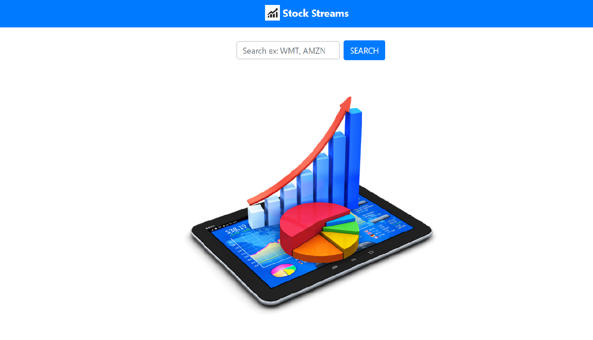
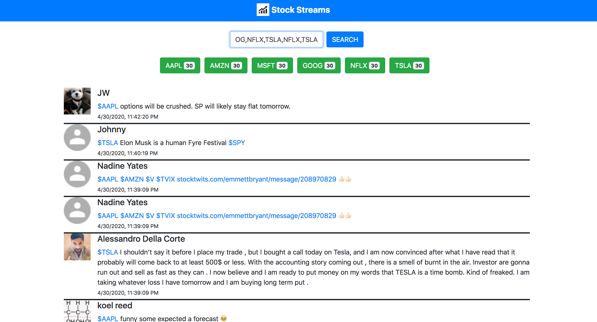

View Live at : https://stock-streams-client.herokuapp.com/

# Stock Streams - App

An utility app to help get a pulse of the most recent conversations happening around the world about a stock. The tweets are automatically updated every 30 seconds.

Note: Since the underlying public API from StockTwits is rate-limited at max 200 requests per hour, this App may not
respond if that limit has been reached. We have to wait for an hour and try again.

## Background

This app will help you understand what is happening around the stock(s) of your choice, by reading the latest tweets about it.
This App comprises of the Frontend Part (available [here](https://stock-streams-client.herokuapp.com/)) which was bootstrapped using the [Create React App](https://github.com/facebook/create-react-app).
It also has a backend part running on Node.js/ Express which the 'Stock Streams' app calls to retrieve the tweets.
More information about the backend can be found [here](https://github.com/anamika8/stock-streams-api-v1)

### Built With

   <ul>
     <li>React.js</li>
     <li>React-Hooks</li>
     <li>React-Bootstrap</li>
     <li>HTML5</li>
     <li>CSS</li>
   </ul>
   
## Description

Users in Mommy Talks, gets to share their experiences, ask new questions or get helpful suggestions in the form of new posts or comments to existing posts.
Users can also search for topics they are interested in and view their associated content.

### Usage

<ul>
  <li>Allow Users to search for tweets about a stock by providing its cashtag like AAPL (Apple), GOOG (Google), etc.</li>
  <li>Allow Users to add more symbols in the search bar using comma</li>
  <li>Displays new tweets without user intervention every 30 seconds, without the page getting refreshed</li>
  <li>Provides the count of tweets associated with each symbol that is being displayed</li>
  <li>Responsive design helps users to use the App from their phones or tablets</li>
</ul>

Open the app <a href="https://stock-streams-client.herokuapp.com/" target="_blank">here</a>. You will see the landing page like this -

Now, search for one or more stocks (comma-separated) by clicking on the 'SEARCH' button or pressing Enter/ Return.
You will see a page like this:

